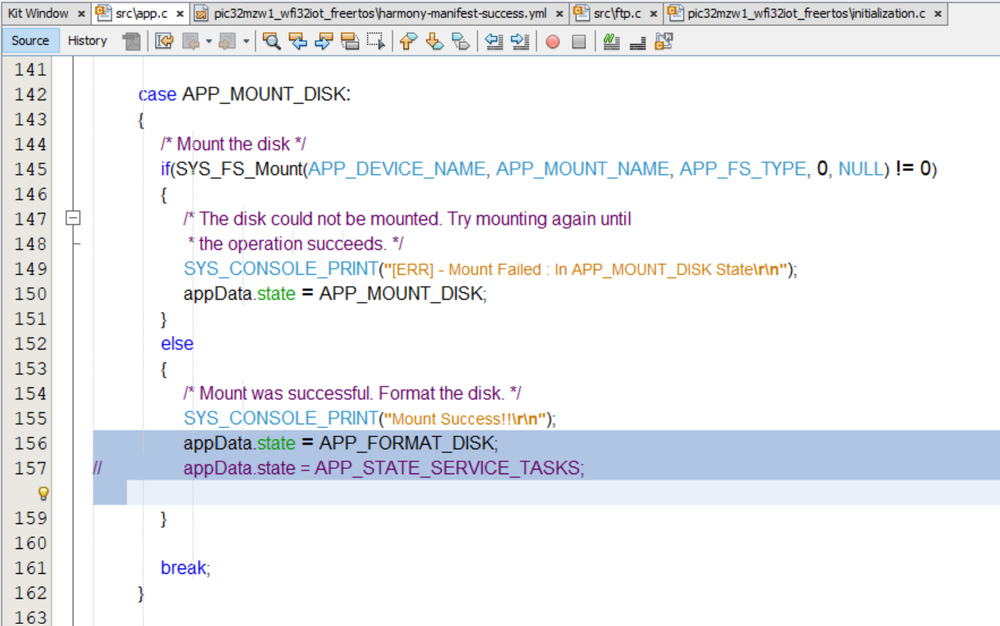
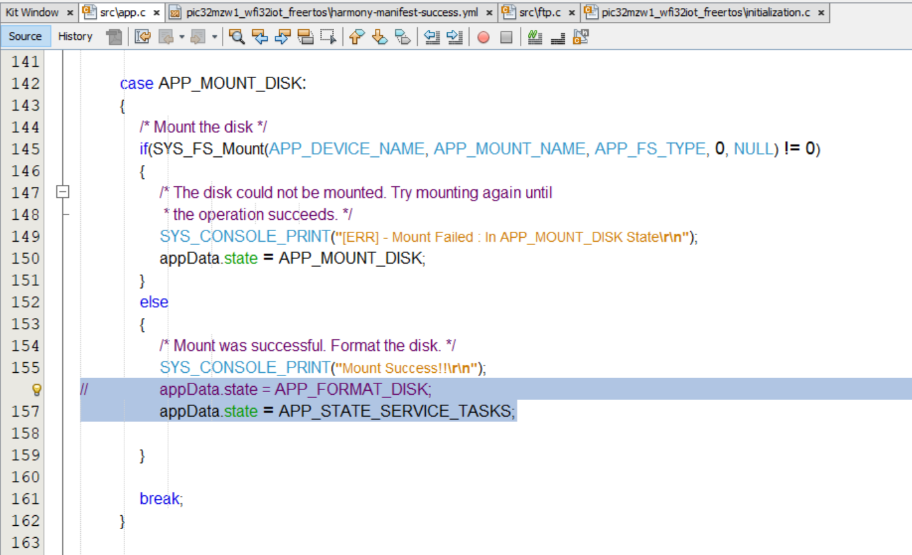

# FTP Server using littlefs File System for WFI32-IoT board

## Introduction
This MPLAB Harmony application demonstrates FTP server using littlefs file system - [A little fail-safe file system](https://github.com/littlefs-project/littlefs).
The [WFI32-IoT board](https://ww1.microchip.com/downloads/aemDocuments/documents/WSG/ProductDocuments/UserGuides/EV36W50A-WFI32-IoT-Board-Users-Guide-DS50003262.pdf) will boot-up in SoftAP mode, with an AP name 'DEMO_AP_SOFTAP' and will host the FTP Server. This application uses SST26 memory module available on the WFI32-IoT board, as SPI Flash. The FTP server stores files on the SST26 memory, using littlefs and FTP client will read from and write to this memory using littlefs.

### Hardware Requirements
- [WFI32-IoT board](https://www.microchip.com/en-us/development-tool/EV36W50A)

### Software Requirements
- [MPLAB X IDE](https://www.microchip.com/en-us/development-tools-tools-and-software/mplab-x-ide) (v6.00 or later)
- [MPLAB XC32](https://www.microchip.com/en-us/development-tools-tools-and-software/mplab-xc-compilers) (v3.01 or later)
- [MPLAB Harmony 3](https://www.microchip.com/en-us/development-tools-tools-and-software/embedded-software-center/mplab-harmony-v3)
	- Note: The project was developed and tested using the MPLAB X v6.00, MPLAB XC32 v3.01.

### MHC Configuration for the application

- MHC is launched by selecting **Tools \> Embedded \> MPLAB® Harmony 3 Configurator** from the MPLAB X IDE. 
The list of MHC components used in this application is as below:

- The following 'Project Graph' diagrams show the linking in between MHC components used in the application.
  
    - Root Layer Project Graph:
    - System Configuration Project Graph:

The application uses littlefs-FS over FTP server to store files on SST26 SPI flash memory using Memory driver instance 0, SST26 driver, and SPI peripheral library module as shown in the Root project graph.

 

- MHC configurations for the modules used in this project are as shown below:

 

 

 

### Setting up WFI32-IoT board
- Connect the Debug USB port on the board to the computer using a micro USB cab

### Running the Application
- Open the project and launch Harmony3 configurator
- Enable AP mode and configure softAP credentials from WIFI Service MHC configuration options
- Save configurations and generate code via MHC 
- Build and program the generated code into the hardware using its IDE
- Open the Terminal application on the computer
- Connect to the "USB to UART" COM port and configure the serial settings as follows:
    - Baud : 115200
    - Data : 8 Bits
    - Parity : None
    - Stop : 1 Bit
    - Flow Control : None
- Device will boot-up in softAP mode and will display the softAP mode IP address
- Now, try to connect laptop/phone - the device you will be running FTP client on, with the softAP
- Once the WiFi station(STA) device is connected to AP, its MAC and IP address will be displayed on the terminal app as below:

- Establish the FTP server-client connection and verify basic FTP commands such as put, get, mkdir, rmdir, delete, ls, cd, pwd as below:

### Note/Known issues:
1. After re-generating code via MHC, please check if pragma defined for High Speed SPI is enabled, in initialization.c file
   - #pragma config HSSPIEN = ON
2. As of now, there's no user authentication method set. So, any FTP client can access the files hosted by FTP server. Please check if the variable authRes is set to true in firmware/src/config/../library/tcpip/src/ftp.c file
   - bool authRes = true;
3. While programming the WFI32-IoT board with this application for the first time, please check if the following code from src/app.c is in place:
   

4. For the subsequent power-ups of the device with the same application, please make following changes in the src/app.c file to retain server hosted files from earlier execution of the app

